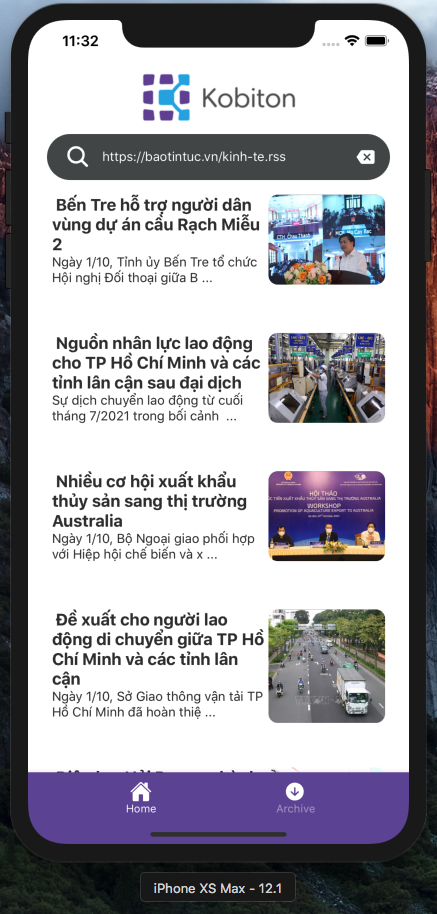
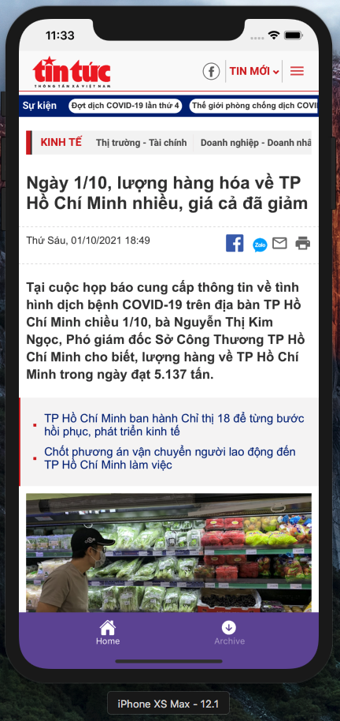
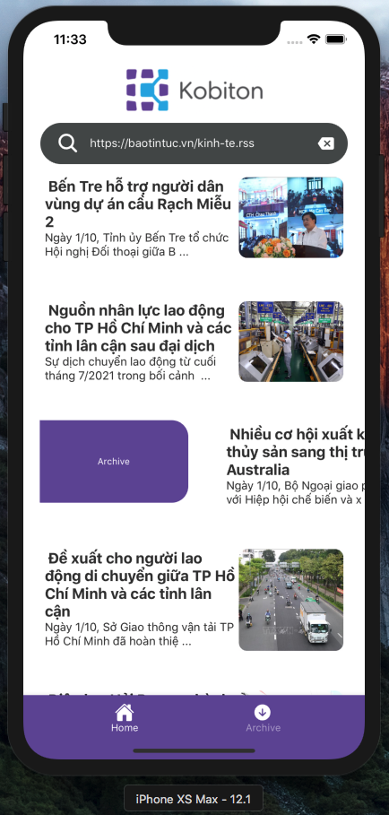
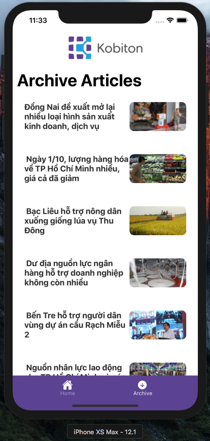
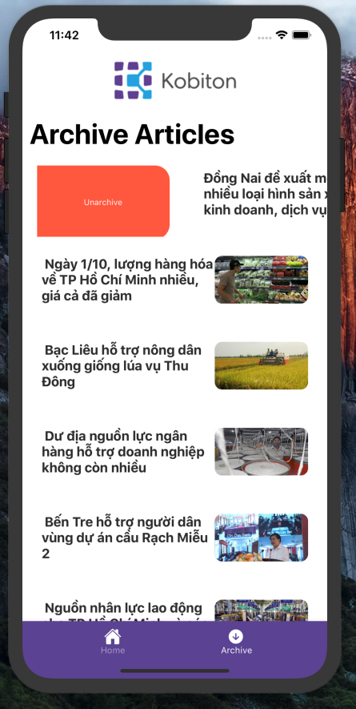
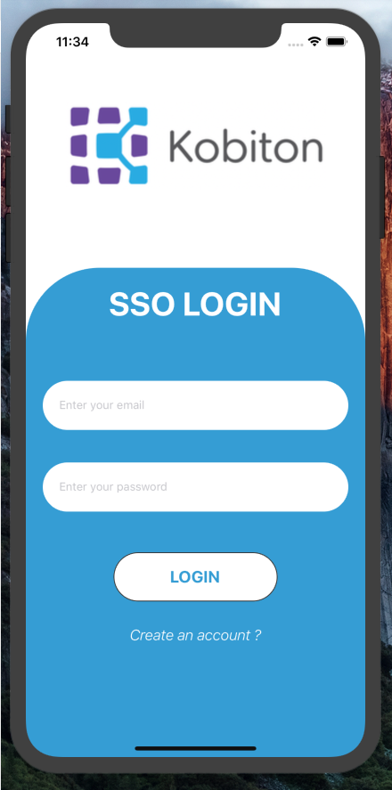

# 🚀 KOBITON - RSI READER  🚀

## 🚀 Overview
**RSI READER KOBITON INTERVIEW PROJECT**
- **Easy to use** 🤘
- **Made with React Native Expo** ⚡
- **TypeScript supported** 🌞
- **SSO Login with Firebase**
- **Raw UI coding**

## 🚀 Screenshots 
<div style="display:flex;justify-content:center;flex-wrap:wrap;">







</div>
## 🚀 Functional Requirements

- [x] Allows user to input a RSS URL (eg : vnexpress/tinhte...) and read the content (WebView).
- [x] Can save to read later (Async Storage)
- [x] Pretty UI (Need more design)
- [x] SSO Login - Register (Firebase Authentication)

## 🚀 Installation and Usage

Be sure, you have installed all dependencies and applications to run Expo project on your computer : [Getting Started with Expo](https://docs.expo.io/get-started/installation/).

This project works fine on iOS and Android.
- Tested on IOS Simulator Iphone XS Max

### Running the project

Clone this repository :

```
git clone https://github.com/giavudangle/kobiton-rss-reader-app
cd kobiton-rss-reader-app
```

Install packages :

```
yarn install
```

When installation is complete, run it :

```
yarn start
```
You must register an account (firebase account), that save a token in async storage, so you dont need to login anymore.

```
Demo account :
Kobiton@gmail.com
test2202
```

Put these rss links into rss-placeholder and submit
```
RSS Resources :  
https://vnexpress.net/rss/thoi-su.rss
https://baotintuc.vn/kinh-te.rss
https://tuoitre.vn/rss/tin-moi-nhat.rss
https://vietnamnet.vn/rss/kinh-doanh.rss
```

